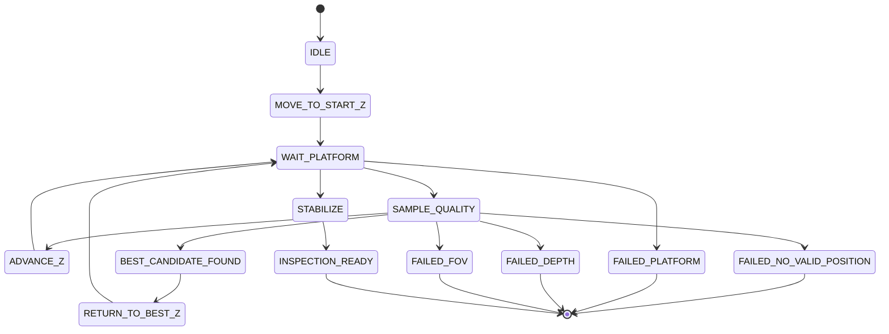

# System Integration Contract

## 1. System-level orchestration goal

The final runtime is intended to be managed by one orchestrator that sequences the full machine workflow:

WAIT_OBJECT
  -> CONVEYOR_MOVE
  -> CONVEYOR_STOP
  -> STRUCTURED_LIGHT_SCAN
  -> structured-light PLY generation
  -> StructuredLightAdapter
  -> PosePlanner
  -> InspectionPlan
  -> safe Z move
  -> pitch/roll move
  -> Automatic Z Search
  -> surface-only anomaly inspection
  -> next pose
  -> result aggregation
  -> CONVEYOR_OUT

This contract document defines the subsystem boundaries and data flow, but does not implement the final runtime process in one monolithic `run_system.py` yet.

---

## 2. Boundary contract

### Structured Light subsystem

This subsystem is the geometry producer.

Responsibilities:

- low-Z structured-light capture
- phase/depth/mask extraction
- PLY or object cloud generation
- optional platform/floor artifact emission

This code is not copied into the defect-detection repo. It remains external and is consumed through a narrow adapter boundary.

### defect_detection runtime

This side is the standardized contract consumer.

Responsibilities:

- read structured-light outputs
- validate metadata and coordinate semantics
- choose a target pose
- move the platform safely
- run automatic Z search
- run surface-only anomaly inspection

---

## 3. Adapter API

The adapter is intentionally small and strict:

```python
result = StructuredLightAdapter.from_directory(run_dir=Path(...))
# or
result = StructuredLightAdapter.from_ply(ply_path=Path(...))
```

This adapter only performs:

- result directory and file discovery
- PLY validation
- artifact path normalization
- cloud-type classification
- coordinate metadata generation
- metadata validation

It does not:

- re-run phase processing
- regenerate the PLY
- detect anomalies
- move the platform

---

## 4. StructuredLightResult contract

```python
@dataclass(frozen=True)
class StructuredLightResult:
    schema_version: str
    run_id: str
    source_directory: Path | None

    ply_path: Path
    cloud_type: CloudType

    coordinate: CoordinateConvention

    object_mask_path: Path | None
    phase_path: Path | None
    depth_path: Path | None

    point_count: int | None

    has_color: bool
    has_normals: bool

    metadata: Mapping[str, Any]
```

Required semantics:

- `schema_version` allows future compatibility checks
- `run_id` identifies the structured-light run
- `source_directory` tracks the result folder when available
- `cloud_type` tells the downstream planner which cloud variant is present
- `coordinate` gives the meaning of X/Y/Z so downstream code does not misinterpret the geometry

---

## 5. Cloud type enum

```python
class CloudType(str, Enum):
    OBJECT_ONLY = "OBJECT_ONLY"
    OBJECT_AND_PLATFORM = "OBJECT_AND_PLATFORM"
    OBJECT_PLATFORM_FLOOR = "OBJECT_PLATFORM_FLOOR"
    UNKNOWN = "UNKNOWN"
```

The adapter must clearly distinguish the following categories:

- object only
- object + platform
- object + platform + floor
- unknown / unsupported

The pose planner must never silently substitute one cloud type for another. If object-only data is required and only floor-included data exists, an explicit validation error is raised.

---

## 6. Coordinate convention

```python
@dataclass(frozen=True)
class CoordinateConvention:
    x_description: str
    y_description: str
    z_description: str

    xy_unit: str
    z_unit: str

    origin_description: str

    image_width: int | None
    image_height: int | None

    x_direction: str
    y_direction: str
    z_direction: str
```

This is the critical contract for the current structured-light code: the geometry is not blindly treated as millimeter-accurate absolute coordinate data.

The current analysis supports the following careful interpretation:

- X: image-centered, horizontally relative coordinate
- Y: image-centered, vertically relative coordinate
- Z: phase-derived relative height, not guaranteed to be a calibrated mm system unless the external pipeline explicitly proves it

This avoids unsafe assumptions.

---

## 7. PLY discovery policy

The adapter follows the actual structured-light output naming pattern that was already observed in the project analysis. It does not invent new names.

Priority rules:

1. prefer object-only cloud for object-related inspection work
2. if object-only is unavailable and required, raise an explicit error
3. do not silently substitute `OBJECT_AND_PLATFORM` or `OBJECT_PLATFORM_FLOOR` for object-only

When multiple PLY files exist, the adapter uses cloud-type priority rather than simply picking the newest file.

---

## 8. File discovery rules for from_directory()

The adapter resolves the latest relevant result directory and then searches for:

- final PLY file
- object mask file
- phase image stack or selected phase artifact
- depth artifact
- optional metadata JSON or manifest

The adapter does not re-create phase data or geometry. It only validates what the external subsystem already produced.

---

## 9. PLY ↔ RGB pixel mapping contracts

Mapping is only included when the structured-light code proves the conversion. The adapter does not guess it.

```python
class CoordinateMapper(Protocol):
    def ply_xy_to_rgb_pixel(self, x: float, y: float) -> tuple[int, int]: ...
    def rgb_pixel_to_ply_xy(self, px: int, py: int) -> tuple[float, float]: ...
```

If the structured-light output does not provide a compatible mapping, the adapter should raise `UnsupportedCoordinateMapping` instead of inventing a transform.

---

## 10. PosePlanner contract

The pose planner is geometry-aware but not a machine controller.

Responsibilities:

- analyze the target surface or inspection region from the structured-light result
- select candidate inspection surfaces
- compute target pitch and roll
- return one or more `PoseTarget` values

Responsibilities it does not have:

- direct platform motion
- final inspection Z computation
- realtime closed-loop motor control

```python
class PosePlanner(Protocol):
    def plan(self, structured_result: StructuredLightResult) -> InspectionPlan:
        ...
```

The actual algorithm is still TODO. This phase defines only the interface contract and the required inputs/outputs.

---

## 11. PoseTarget design

```python
@dataclass(frozen=True)
class PoseTarget:
    pose_id: str
    pitch_deg: float
    roll_deg: float
    target_surface_id: str | None
    confidence: float | None
    source: str
    metadata: Mapping[str, Any]
```

Important rule: `PoseTarget` does not contain the final inspection Z.

If a safe hint is needed, it may be expressed separately and clearly labeled as a non-final hint, for example `safe_z_hint_cm`, but it must not be confused with the final inspection Z that a later automatic Z search selects.

---

## 12. InspectionPlan design

```python
@dataclass(frozen=True)
class InspectionPlan:
    plan_id: str
    source_ply: Path
    poses: tuple[PoseTarget, ...]
    metadata: Mapping[str, Any]
```

This allows the system to evaluate multiple poses sequentially:

- pose 01 -> inspect
- pose 02 -> inspect
- pose 03 -> inspect

The final orchestrator can loop over `inspection_plan.poses` without hardcoding a single pose assumption.

---

## 13. Platform controller contract

The platform controller sits behind the pose planner and is separated from the geometry layer.

```python
@dataclass(frozen=True)
class PlatformPoseCommand:
    z_cm: float
    roll_deg: float
    pitch_deg: float
```

```python
@dataclass(frozen=True)
class PlatformTelemetry:
    z_cm: float
    roll_deg: float
    pitch_deg: float
    target_reached: bool
    homing: bool
    motor_1: int | None
    motor_2: int | None
    motor_3: int | None
    imu_mode: int | None
    timestamp: float
```

The PlatformController interface is defined as:

```python
class PlatformController(Protocol):
    def move_to(self, command: PlatformPoseCommand) -> None: ...
    def get_telemetry(self) -> PlatformTelemetry: ...
    def wait_until_reached(self, timeout: float) -> PlatformTelemetry: ...
```

This keeps the business logic independent of the serial implementation. The actual STM protocol will be implemented later after the firmware is verified.

---

## 14. Mock platform controller

Because actual firmware wiring is not available yet, a mock controller is valuable for state-machine testing.

Example behavior:

- `move_to()` updates an internal command state
- `get_telemetry()` returns a synthetic telemetry record
- `wait_until_reached()` returns after a short internal simulated settle delay

This allows the higher orchestration logic to run without real serial hardware.

---

## 15. Automatic Z Search role

Automatic Z search is responsible for determining the final inspection height after a pose has been selected.

It does not compute pose or plane geometry from the PLY. Instead it uses the current pose and the camera/inspection pipeline to search across candidate Z values.

Inputs:

- pose target
- current platform state
- inspection camera
- surface ROI logic
- quality evaluator

Outputs:

- best inspection position
- quality sample history
- success/failure reason

---

## 16. Automatic Z Search DTOs

```python
@dataclass(frozen=True)
class InspectionQualitySample:
    z_cm: float

    depth_valid_ratio: float
    plane_inlier_ratio: float
    plane_residual_mm: float

    object_area_px: int
    surface_area_px: int
    valid_patch_count: int

    touches_fov_edge: bool

    rgb_mean_brightness: float | None
    rgb_saturated_ratio: float | None
    rgb_sharpness: float | None

    gate_passed: bool
    quality_score: float | None
    reasons: tuple[str, ...]
```

```python
@dataclass(frozen=True)
class BestZResult:
    success: bool
    best_z_cm: float | None
    best_quality: InspectionQualitySample | None
    samples: tuple[InspectionQualitySample, ...]
    failure_reason: str | None
    pose_id: str
```

The search is gate-driven first and quality-scored second. A candidate is only selected if it passes the minimum gate conditions and ranks highest among valid candidates.

---

## 17. Automatic Z Search state machine



This state machine is intentionally higher-level; actual walking of the actuators happens only in the controller layer.

---

## 18. Z search and ROI logic contract

A key rule is that Z search does not alter ROI logic by arbitrary scaling.

Instead, every candidate Z position is evaluated as a fresh measurement:

- capture current RGB + depth
- re-run board-plane / surface detection
- compute object mask / surface mask
- compute valid patch count
- evaluate inspection-quality gates

The best Z is selected from this evaluation, not derived from a hand-wavy pixel scaling rule.

---

## 19. Orchestration pseudo-code

```python
structured_result = StructuredLightAdapter.from_directory(run_dir)
inspection_plan = pose_planner.plan(structured_result)

for pose in inspection_plan.poses:
    platform.move_to_safe_pose(pose)
    platform.wait_until_reached(timeout=5.0)

    z_result = automatic_z_search.search(
        pose=pose,
        platform=platform,
        camera=camera,
        inspection_quality=inspection_quality,
    )

    if not z_result.success:
        continue

    inspection_data = surface_inspection.capture_current()
    anomaly_result = anomaly_detector.inspect(inspection_data)
```

This is the intended orchestration flow. It is not yet implemented as a full `run_system.py`.

---

## 20. Firmware-unknown parts

The following details must remain unresolved until the actual STM firmware is checked:

- exact serial command syntax
- Z/R/P scaling units
- command timeout semantics
- command queue / buffering rules
- protocol for target reach confirmation
- homing procedure and safety conditions
- fault states and retry policy

Therefore, the platform controller interface is defined but not implemented with a real serial transport yet.

---

## 21. In-scope and out-of-scope for this phase

### In scope

- adapter contract
- structured-light result normalization
- coordinate conventions
- pose planning interface
- platform DTO interface
- automatic Z search interface
- orchestration boundary definitions

### Out of scope

- real STM serial transmission
- real platform hardware motion
- actual pitch/roll algorithm implementation
- actual Z search optimization algorithm
- AE inference
- training or model execution
- conveyor drive implementation
- full `run_system.py` implementation

---

## 22. Files to be created in this phase

The current phase should include thin skeleton files such as:

- `src/integration/structured_light_adapter.py`
- `src/integration/pose_types.py`
- `src/integration/pose_planner.py`
- `src/platform/types.py`
- `src/platform/controller.py`
- `src/platform/mock_controller.py`
- `src/inspection/z_search_types.py`
- `src/inspection/automatic_z_search.py`

These files define the interface and data contracts without implementing hardware-specific logic.

---

## 23. Final principle summary

The decisive boundary remains:

Structured Light subsystem = geometry producer

defect_detection runtime = standardized contract consumer

The interface layer is responsible for the stable handoff. All algorithmic details stay outside this boundary until the contract is proven stable.
